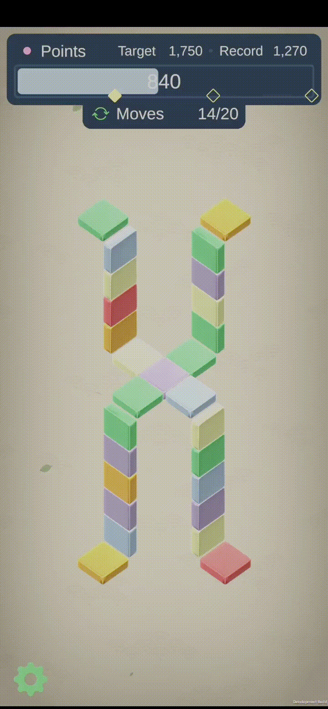
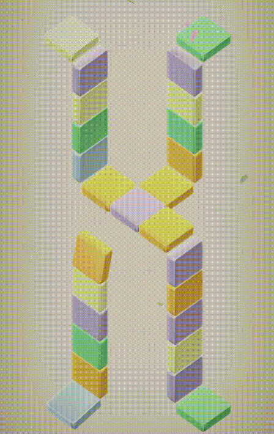
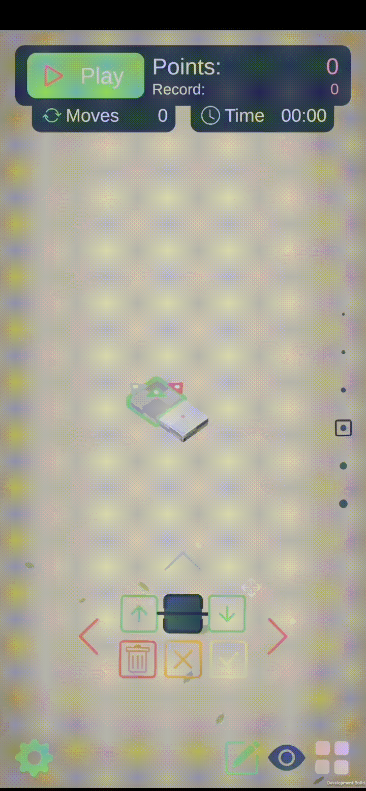

# Tile's Waltz

### Note

> This game started as a little project during quarentine of COVID-19 to better understand and try libraries such as UniRX and Zenject, what a better way to understand a framework than building a game using it.

## Summary

Tile's Waltz is a simple color matching game that uses the shortest path algorithm as the core mechanic of the game. When you click a tile it will "remove" that tile and displace all the tiles in the shortest path to a "leaf" node to their neighbor position, this means the first tile in the path will take the place of the removed tile, the second will take the place of the first, the third the place of the second and so on. In the structure a "leaf" tile is a tile that only has one connection.

When more than 2 tiles next to each other share the same color a "combo" happens. A combo removes these tiles and creates new in their places with a newer color, when you combine more than 3 tiles power ups start to appear.

## Power Ups

* Combine 4 in a straight line:

If you combine 4 in a straight line you get a directional power in the orthogonal direction of that line, when the tile with this power up is clicked, all the tiles in that direction will be removed. It's important to position properly the tile to make the best use of this power.

* Combine 5 or more tiles:

If you combine 5 of more tiles you get a color power up, when you click the tile with this power up it will the remove all the tiles that have this same color, it's important to look at the map to make the best use of it.

## Level Editor

You can make your own levels in this game, it provides a level editor that lets you make your own levels. You can also share your levels with other users, as the levels are converted to a code that can be imported in the game, another option is to use QR codes, the game can read a QR code with the map information and import that map.

## Current

The game currently contains:

* 13 playable maps.
* Two power ups for bigger combos.
* Level editor
* Sharing and importing through text or QR
* Basic tutorial

## In Progress

The game stills in development, there are some things that are in progress:

* FTUE Improvements
* Add map "pointers" in the game map to the UI, easy return if the user drags too far away in the game map.
* Localization
* Ads, maybe
* Check tablets aspect ratio
* Map level previewer